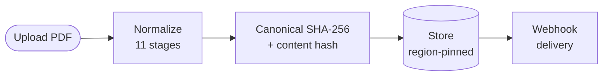
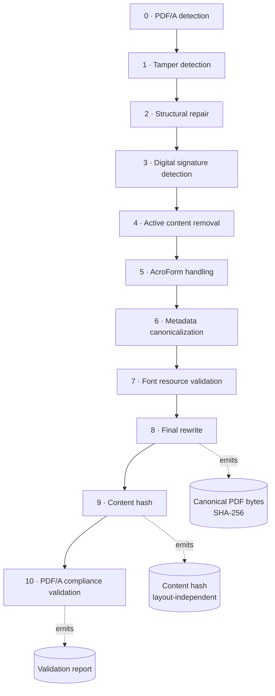

# The normalization pipeline

Every PDF submitted to PDFCanon flows through the same deterministic pipeline. The high-level shape:

The pipeline itself is fixed and ordered — stages do not run in parallel and do not skip:

## Stage reference

| Stage | Name                            | What it does                                                            |
| ----- | ------------------------------- | ----------------------------------------------------------------------- |
| 0     | **PDF/A detection**             | Identify the declared compliance level of the input.                    |
| 1     | **Tamper detection**            | Detect incremental-update injection, shadow content, post-EOF data.     |
| 2     | **Structural repair**           | Fix malformed cross-reference tables and trailer dictionaries.          |
| 3     | **Digital signature detection** | Identify and handle existing digital signatures per policy.             |
| 4     | **Active content removal**      | Strip JavaScript, embedded executables, launch actions.                 |
| 5     | **AcroForm handling**           | Flatten or preserve interactive form fields.                            |
| 6     | **Metadata canonicalization**   | Normalize XMP and DocInfo metadata to epoch timestamps.                 |
| 7     | **Font resource validation**    | Validate fonts and detect non-embedded subsets.                         |
| 8     | **Final rewrite**               | Linearize and emit a clean canonical PDF with deterministic IDs.        |
| 9     | **Content hash**                | SHA-256 over extracted text for semantic deduplication.                 |
| 10    | **PDF/A compliance validation** | Validate PDF/A compliance of the output (when input declared PDF/A).    |

## Determinism guarantees

For a given input PDF and a given [`toolchain_version`](./toolchain-version.md), every stage is deterministic. The same input always produces the same canonical bytes and the same SHA-256, on any host, in any region.

The pipeline is implemented in `src/PDFCanon.Worker/Pipeline/Stages/` — the diagram above mirrors the actual stage order one-for-one.

## Next

- [Why normalize PDFs?](./why-normalize.md)
- [Toolchain versioning](./toolchain-version.md)
- [Normalizing PDFs (guide)](/guides/normalizing-pdfs)
