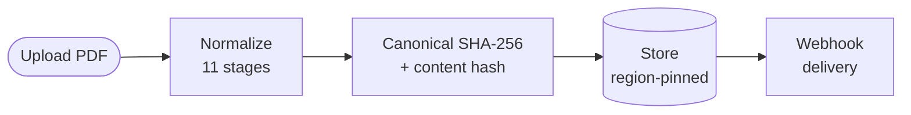

# PDFCanon Documentation

PDFCanon is a PDF normalization API that converts any PDF into a canonical, tamper-evident, PDF/A-compliant document. Use the REST API, official SDKs, or the MCP server to integrate normalization into your workflow.

## Get started

- [**Why normalize PDFs?**](/concepts/why-normalize) — The problem PDFCanon solves
- [**Quickstart**](/quickstart) — Normalize your first PDF in under 5 minutes
- [**Authentication**](/authentication) — API keys and auth headers
- [**API Reference**](/api-reference/normalize) — Full endpoint reference

## Core concepts

- [**Why normalize PDFs?**](/concepts/why-normalize) — Why two identical PDFs produce different hashes
- [**The normalization pipeline**](/concepts/pipeline) — Visual overview of all 11 stages
- [**Toolchain versioning**](/concepts/toolchain-version) — The stability contract behind every hash

PDFCanon normalizes PDFs by running them through a deterministic 11-stage pipeline:

| Stage | Name                            | Description                                                            |
| ----- | ------------------------------- | ---------------------------------------------------------------------- |
| 0     | **PDF/A detection**             | Identify the declared compliance level of the input document           |
| 1     | **Tamper detection**            | Detect incremental-update injection, shadow content, and post-EOF data |
| 2     | **Structural repair**           | Fix malformed cross-reference tables and trailer dictionaries          |
| 3     | **Digital signature detection** | Identify and handle existing digital signatures per policy             |
| 4     | **Active content removal**      | Strip JavaScript, embedded executables, and launch actions             |
| 5     | **AcroForm handling**           | Flatten or preserve interactive form fields                            |
| 6     | **Metadata canonicalization**   | Normalize XMP and DocInfo metadata to epoch timestamps                 |
| 7     | **Font resource validation**    | Validate and detect non-embedded font subsets                          |
| 8     | **Final rewrite**               | Linearize and emit a clean, canonical PDF with deterministic IDs       |
| 9     | **Content hash**                | SHA-256 hash of extracted text content for semantic deduplication      |
| 10    | **PDF/A compliance validation** | Validate PDF/A compliance of the output (when input declared PDF/A)    |

The output is deterministic: the same input always produces the same output hash.

## API version

The current stable API version is `2026-01-01`. All responses include an `apiVersion` field.

## Support

- **Status page** — [status.pdfcanon.com](https://status.pdfcanon.com)
- **Dashboard** — [app.pdfcanon.com](https://app.pdfcanon.com)
- **GitHub** — [github.com/PDFCanon](https://github.com/PDFCanon)
